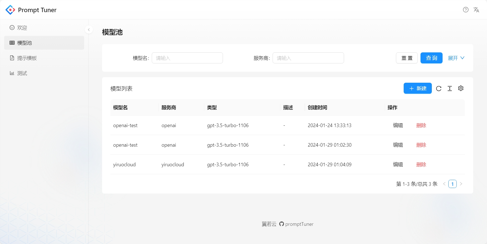
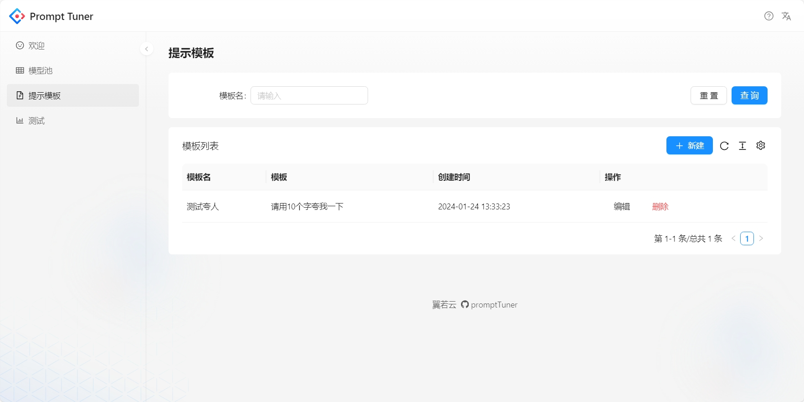
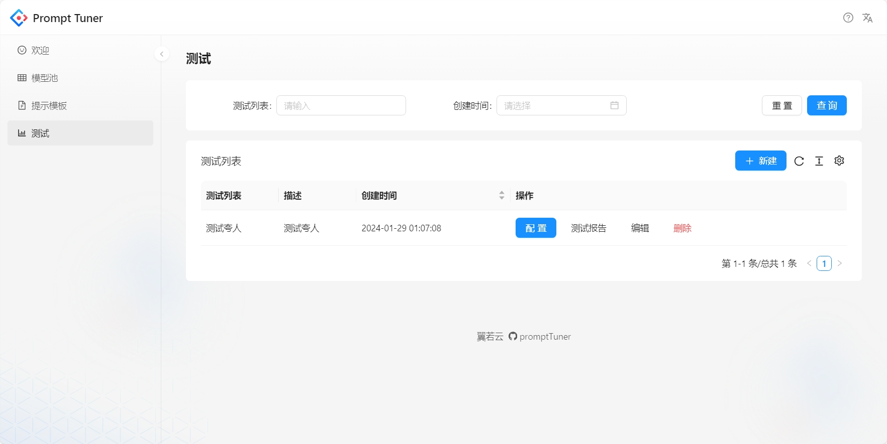
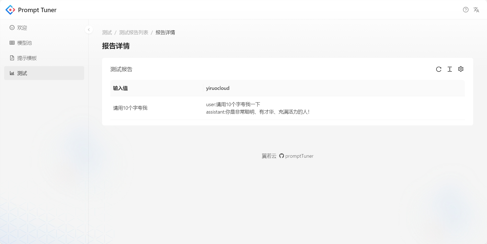

# Prompt Tuner: test your prompt,models

A tool designed to streamline the process of debugging and optimizing prompts for natural language processing (NLP) models. Easily fine-tune and customize prompts for enhanced model performance

# Usage







## Installation

```
cd server && pnpm install
cd ui && pnpm install
```

## Running

```
cd server && pnpm start
cd ui && pnpm start
```

## how to use
1. add model to model pool
2. add prompt template
3. add test
4. config test, select model, prompt template, input variables
5. run test
6. view test result

